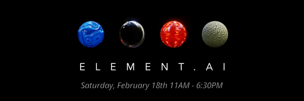

# 

Welcome to ACM AI's Winter 2023 competition, Element.AI!

We **highly encourage you** to read the following instructions!

To check the current leadeboard, go to [http://128.54.69.221:3000/competitions/Element.AI/leaderboard](http://128.54.69.221:3000/competitions/Element.AI/leaderboard)

## Usage

If you are participating in the competition in the basement labs, please refer to `documentation/lab_setup.md` to set up your lab machine.

Then, you can run the following to start your first game!
```
python main.py ./kits/python/main.py ./kits/java/main.py -o replay --render
```

The args are as follows:
- pargs: path to the `main.py` file in your bot(s). Enter the bots in order of player 0 to player 3
- `-l`&emsp;# of iterations in the game. The games will run for 500 iterations during evaluation.
- `-o`&emsp;The desired name of the replay file. Note: the `.json` extension will be added by default.
- `-v`&emsp;Verbose Level (0 = silent, 1 = errors, 2 = warnings, 3 = info)
- `-s`&emsp;Seeds the environment. Useful for testing edge cases.
- `--render`&emsp;Turns on rendering. NOTE: purposefully slows down running so that the user can keep up visually.

## Evaluation
During the competition when submissions are open, we will run a live, trueskill ranked leaderboard that uses every team's latest verified submission. After 6:30PM we will use the leaderboard to seed a double elimination knockout bracket and crown winners based on the results of that. See [./documentation/submission.md](./documentation/submission.md) for specific details.

Make sure to submit your agent to the leaderboard early to test it! Any agent that fails to run will automatically lose their games, including in the knockout rounds. There are no exceptions.

## Documentation

- The [Graphic Documentation](./documentation/Element.AI%20Documentation.pdf) contains explanations of the game rules.
- [obs_and_act.md](./documentation/obs_and_act.md)) contains detailed explanation of the observation and action spaces.
- The [Submission Portal Documentation](./documentation/submission.md) contains an explanation on how to upload submissions.
- The root directory, the replay directory, and the kits each have `README.md`'s which the player should read.

## Development Kits

The Java and Python kits are located in the `kits` directory.

## Prizes

- 1st place: $1500
- 2nd place: $1000
- 3rd place: $750
- 4th place: $450
- 5th place: $300
- 6-10th place: $150

In addition, all participants are eligible for a $250 raffle!